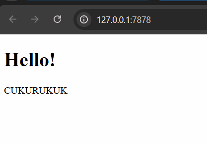
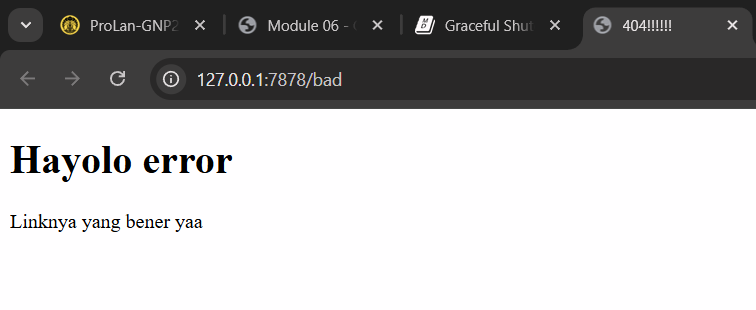

### Refleksi Milestone 1: Single-Threaded Web Server

Pada milestone ini, saya belajar bagaimana menggunakan library standar Rust std::net::TcpListener untuk membuat server yang mendengarkan koneksi pada alamat IP dan port tertentu. Melalui perintah TcpListener::bind, server dapat menerima koneksi TCP yang masuk dan memprosesnya satu per satu menggunakan iterasi pada listener.incoming(). Setiap koneksi yang masuk direpresentasikan oleh TcpStream yang memungkinkan komunikasi antara server dan klien. Saya menyadari bahwa penggunaan .unwrap() di sini berfungsi untuk menangani potensi error saat binding port, meskipun dalam aplikasi produksi sebaiknya ditangani secara lebih elegan. Pencetakan pesan "Connection established!" di terminal mengonfirmasi bahwa handshake antara browser dan server telah berhasil dilakukan. Namun, pada tahap ini server masih bersifat sinkron dan hanya bisa menangani satu request dalam satu waktu, sehingga request lainnya harus menunggu antrean.

### Refleksi Milestone 2: Returning HTML

Setelah berhasil menangani koneksi, saya melangkah lebih jauh dengan mengembalikan konten HTML asli agar browser tidak menampilkan halaman kosong. Di sini, saya menggunakan BufReader untuk membaca data dari TcpStream secara efisien dan memetakan baris-baris request HTTP tersebut ke dalam sebuah Vec. Proses penyusunan HTTP response dilakukan dengan sangat manual, mencakup status line HTTP/1.1 200 OK, header Content-Length, dan body yang berisi konten dari file hello.html. Saya belajar bahwa pemisahan antara header dan body dalam protokol HTTP harus menggunakan baris kosong (\r\n\r\n) agar browser dapat memparsingnya dengan benar. Penggunaan fs::read_to_string memudahkan pembacaan file eksternal, namun server harus dijalankan dari direktori yang sama dengan lokasi file HTML tersebut agar tidak terjadi error. Hasilnya, server kini mampu memberikan antarmuka visual yang dapat dirender oleh browser secara langsung.

### Refleksi Milestone 3: Validating Request and Selectively

RespondingPada milestone ini, saya menerapkan logika validasi untuk memastikan server merespons dengan tepat berdasarkan request line yang diterima. Dengan melakukan refactoring menggunakan blok match, kode menjadi lebih bersih dan mudah dibaca karena pemisahan antara penentuan status line dan nama file yang akan dikirim. Jika request mengarah ke /, server akan mengembalikan hello.html, namun jika request tidak dikenal, server akan mengirimkan kode status 404 NOT FOUND beserta file 404.html. Refactoring ini sangat penting untuk menerapkan prinsip Separation of Concerns, di mana logika pemilihan respons dipisahkan dari logika pengiriman data ke stream. Saya memahami bahwa server yang baik harus mampu menangani input pengguna yang tidak valid secara aman tanpa menyebabkan program berhenti berjalan. Hal ini memberikan pengalaman pengguna yang lebih profesional melalui pesan kesalahan yang informatif.

### Refleksi Milestone 4: Simulation of Slow Response
Pada milestone ini, saya belajar mengenai efek dari proses yang memakan waktu lama terhadap kinerja server single-threaded. Melalui implementasi endpoint /sleep, saya mensimulasikan beban kerja berat dengan menunda eksekusi menggunakan thread::sleep selama 10 detik. Ketika saya mencoba mengakses /sleep di satu tab browser dan segera membuka tab lain untuk mengakses /, saya mendapati bahwa tab kedua tidak dapat dimuat hingga proses pada tab pertama selesai. Hal ini terjadi karena server hanya memiliki satu thread utama untuk menangani semua koneksi yang masuk, sehingga request yang sedang diproses akan memblokir request lainnya.  Fenomena ini menunjukkan bahwa server single-threaded sangat tidak efisien untuk menangani trafik yang padat atau tugas yang memakan waktu lama. Pengujian ini memberikan pemahaman mendalam tentang mengapa sistem modern memerlukan konkurensi untuk menjaga responsivitas bagi banyak pengguna secara bersamaan.  Oleh karena itu, langkah selanjutnya untuk mengimplementasikan thread pool menjadi sangat krusial dalam meningkatkan throughput server

### Refleksi Milestone 5: Multithreaded Server using Threadpool
Pada milestone terakhir ini, saya telah berhasil mengimplementasikan ThreadPool untuk menangani banyak koneksi secara konkuren. Dengan menggunakan ThreadPool, server tidak lagi membuat thread baru untuk setiap request yang masuk, melainkan menggunakan kembali sejumlah thread yang sudah ditentukan sejak awal, sehingga lebih efisien dalam penggunaan sumber daya sistem.  Saya belajar bagaimana menggunakan Channel (mpsc) untuk mengirimkan tugas (Job) dari thread utama ke thread pekerja (worker). Penggunaan Arc<Mutex<Receiver>> sangat krusial di sini agar banyak worker dapat berbagi akses ke antrean tugas secara aman tanpa terjadi data race. Kini, saat saya mengakses endpoint /sleep, thread utama tidak akan terblokir karena tugas tersebut dikerjakan oleh salah satu worker di dalam pool, sehingga thread lainnya tetap bisa melayani request ke endpoint /.  Implementasi ini secara drastis meningkatkan throughput server dan menjadikannya lebih tangguh dalam menangani beban kerja yang bervariasi.

### Refleksi Bonus: Function Improvement (build vs new)
Dalam pengembangan Rust yang idiomatik, penggunaan fungsi build seringkali lebih disukai daripada new untuk konstruktor yang memiliki risiko kegagalan. Fungsi new tradisional biasanya menggunakan panic! jika input (seperti jumlah thread) tidak valid, yang mana bisa menghentikan seluruh program secara paksa. Dengan menggantinya menjadi build yang mengembalikan tipe Result, saya memberikan kesempatan kepada pemanggil fungsi untuk menangani error tersebut secara elegan. Pola ini meningkatkan kekokohan kode (robustness) karena kesalahan parameter tidak langsung menghancurkan jalannya server. Perbandingan ini mengajarkan saya tentang pentingnya desain API yang aman dan bagaimana Rust mendorong pengembang untuk memikirkan skenario kegagalan sejak awal pengembangan.